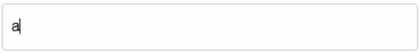

# React Multitag

A simple and lightweight tag list input component.



[](https://codesandbox.io/p/sandbox/c3g567)

## 🪄 Features
- Navigate and delete elements using the keyboard
- Automatically add items with keyboard input and support for custom keybinds
- Add custom tag elements with props for delete actions and selection styling

## ✏️ Example code
```
import React, { useState } from "react";
import { Taglist } from "react-multitag";

const Example = () => {
  const [tags, setTags] = useState<string[]>([]);

  return <Taglist value={tags} onChange={setTags} />;
};

export default Example;
```

## ⚙️ Props
**This extends all default HTML input props** (which control the text input element)
| Prop                              | Description                                                                     | Type                      |
| -------------------               | ------------------------------------------------------------------------------- | ------------------------- |
| `navigationMode`                           | How the keyboard navigation should behave: <ul><li>**tags** (default): Navigate through tags and delete with 'Backspace'</li><li>**input**: Move the input position to add new elements between existing ones</li></ul>                                                                | `string[]`                |
| `value`                           | Current tag list                                                                | `string[]`                |
| `onChange`                        | Callback with new tag list                                                      | `string[]`                |
| `TagComponent` (optional)         | Custom component for the tag element (implementing the TagProps interface)      | `ComponentType<TagProps>` |
| `separators` (optional)           | List of keys triggering tag to be added (defaults to 'Enter' & ',')             | `string[]`                |
| `containerClassName` (optional)   | Custom classname for the wrapping container (div)                               | `string`                  |
| `inputClassName` (optional)       | Custom classname for the input                                                  | `string`                  |
